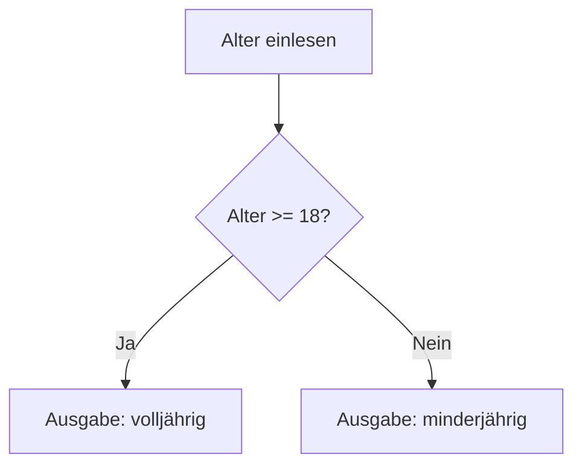

# Kapitel 5 – Kontrollstrukturen

<div class="kurs-progress">
  <div class="step done"></div>
  <div class="step done"></div>
  <div class="step done"></div>
  <div class="step done"></div>
  <div class="step active"></div>
  <div class="step"></div>
  <div class="step"></div>
  <div class="step"></div>
  <div class="step"></div>
  <div class="step"></div>
</div>

<div class="lernziele" markdown>
<h3>Was du in diesem Kapitel lernst</h3>

- Entscheidungen mit `if`, `elif` und `else` treffen
- Vergleichs- und logische Operatoren (`and`, `or`, `not`) sicher einsetzen
- Warum Einrückung in Python zur Syntax gehört
- Mehrere Bedingungen sauber kombinieren
</div>

---

<div class="anknuepfung" markdown>
<span class="ank-label">Wiederholung & Anknüpfung</span>
**Das kennst du schon** aus dem ersten Kursteil: `if`/`elif`/`else`, die Vergleichsoperatoren und das erste `while True`-Beispiel.

**Neu / hier wichtig:** Wir machen die **Einrückung** als Strukturmittel wirklich klar und sammeln die typischen Anfänger-Fehler (`=` vs. `==`, Doppelpunkt vergessen, falsche Einrückung). Schleifen vertiefen wir dann in Kapitel 6.
</div>

## So gehst du vor

1. Achte ab jetzt penibel auf **Einrückung** – in Python ist sie kein Stil, sondern Pflicht.
2. Teste jede Bedingung mit **Grenzfällen** (z. B. genau 18 Jahre).
3. Bearbeite die **Kurzübungen**.

---

## 5.1 Wozu Kontrollstrukturen?

Ohne Verzweigungen würde ein Programm **immer dieselben Schritte** ausführen. Mit `if` reagiert dein Programm auf Eingaben, Werte oder Berechnungen – es trifft **Entscheidungen**.



---

## 5.2 Vergleichsoperatoren

Ein Vergleich liefert immer einen **Wahrheitswert**: `True` oder `False`.

| Operator | Bedeutung | Beispiel | Ergebnis |
|---|---|---|---|
| `==` | gleich | `5 == 5` | `True` |
| `!=` | ungleich | `5 != 3` | `True` |
| `>` | größer | `10 > 3` | `True` |
| `<` | kleiner | `2 < 8` | `True` |
| `>=` | größer oder gleich | `18 >= 18` | `True` |
| `<=` | kleiner oder gleich | `5 <= 3` | `False` |

!!! warning "Stolperstein Nr. 1: `=` vs. `==`"
    `=` **weist zu** (`x = 5` heißt: x bekommt den Wert 5).
    `==` **vergleicht** (`x == 5` heißt: ist x gleich 5?).
    Diese Verwechslung ist *der* Klassiker. In einer `if`-Bedingung steht **immer** `==`.

---

## 5.3 Logische Operatoren

Mehrere Bedingungen verknüpfst du mit `and`, `or`, `not`:

| Operator | Wahr, wenn … | Beispiel | Ergebnis |
|---|---|---|---|
| `and` | **beide** wahr sind | `True and False` | `False` |
| `or` | **mindestens eine** wahr ist | `True or False` | `True` |
| `not` | das Gegenteil | `not True` | `False` |

```python
name = "Tina"
alter = 20
zahl = 7

if name == "Tina" and alter > 18 and zahl == 7:
    print("Geheime Nachricht freigeschaltet!")
```

??? info "Optional: Kennst du schon PHP?"
    Nur relevant, wenn du **PHP schon kennst** – sonst einfach überspringen.

    | Python | PHP |
    |---|---|
    | `and` / `or` / `not` | `&&` / `\|\|` / `!` |
    | `if alter >= 18:` | `if ($alter >= 18) {` |

    Die **Logik** ist identisch – nur die Schreibweise ist anders.

---

## 5.4 if / elif / else

```python
alter = int(input("Wie alt bist du? "))

if alter >= 18:
    print("Du bist volljährig.")
elif alter >= 16:
    print("Du bist fast volljährig (16 oder 17).")
else:
    print("Du bist jünger als 16.")
```

**Die Regeln:**

- Nach `if` / `elif` / `else` steht ein **Doppelpunkt** `:`
- Der zugehörige Block ist **eingerückt** (4 Leerzeichen)
- Es wird **nur der erste zutreffende Zweig** ausgeführt – danach ist Schluss

---

## 5.5 Einrückung ist Pflicht

In Python entscheidet die **Einrückung**, was zu einem `if` gehört – es gibt keine geschweiften Klammern.

```python
if alter >= 18:
    print("Diese Zeile gehört zum if.")
    print("Diese auch – beide sind eingerückt.")
print("Diese Zeile läuft IMMER – sie ist nicht eingerückt.")
```

??? info "Optional: Kennst du schon PHP?"
    Nur relevant, wenn du **PHP schon kennst** – sonst einfach überspringen.

    | Python | PHP |
    |---|---|
    | Einrückung nach `:` | `{ ... }` um den Block |
    | `if x > 0:` + 4 Leerzeichen | `if ($x > 0) {` + Code + `}` |

    In Python **ist** die Einrückung Syntax – ohne sie gibt es `IndentationError`.

!!! warning "Häufige Fehler bei Bedingungen"
    **`SyntaxError: expected ':'`** → Der Doppelpunkt am Ende der `if`-Zeile fehlt.

    **`IndentationError: expected an indented block`** → Nach dem `:` fehlt die eingerückte Zeile, oder sie ist nicht eingerückt.

    **`TabError: inconsistent use of tabs and spaces`** → Tabs und Leerzeichen gemischt. Stelle in VS Code auf „Spaces" um (unten rechts in der Statusleiste).

---

## 5.6 Beispiel: Noten-Bewertung

```python
note = int(input("Note (0–100): "))

if note >= 90:
    print("Note: A")
elif note >= 80:
    print("Note: B")
elif note >= 70:
    print("Note: C")
elif note >= 60:
    print("Note: D")
else:
    print("Note: F")
```

!!! tip "Reihenfolge bei `elif` beachten"
    Weil nur der **erste** zutreffende Zweig läuft, müssen die Grenzen hier **von hoch nach niedrig** geprüft werden. Stünde `>= 60` ganz oben, bekäme auch eine 95 die Note „D".

---

## Kurzübungen

{{ task(file="tasks/tag5_01.yaml") }}

{{ task(file="tasks/tag5_02.yaml") }}

{{ task(file="tasks/tag5_03.yaml") }}
